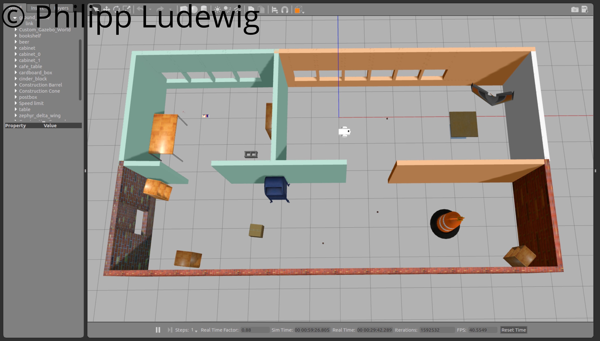
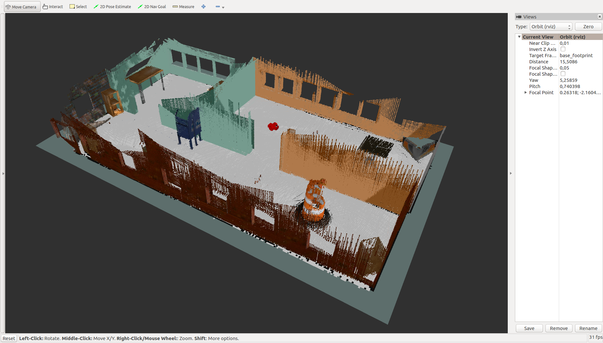
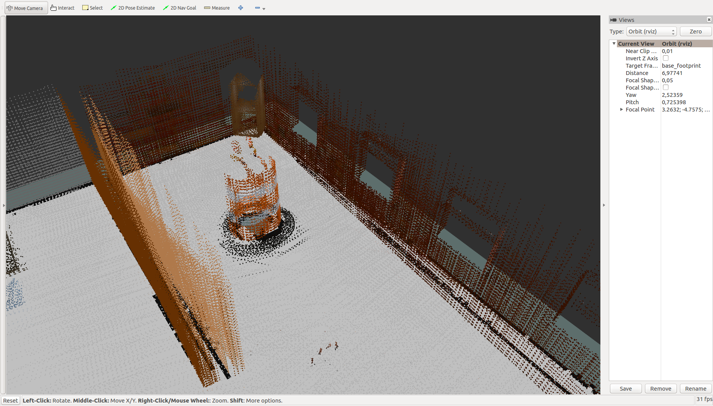
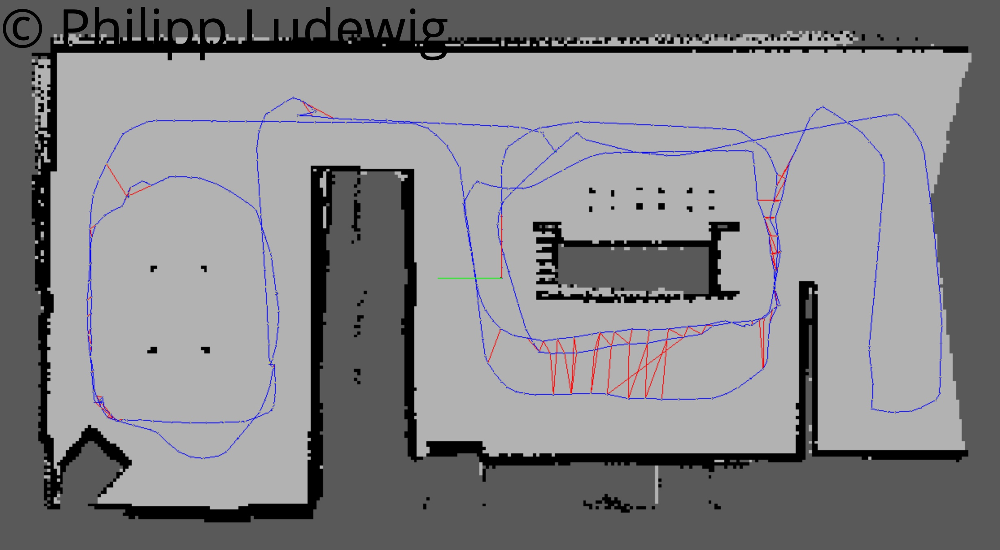

# SLAM Project Map My World
This project demonstrates the application of the SLAM RTAB-MAP algorithm in a simulated Gazebo environment.

#### Full Project Writeup
[Writeup PDF](http://pioneerlabs.de/wp-content/uploads/2019/04/Map-My-World-Writeup.pdf)

#### Video of the mapping process:
https://www.youtube.com/watch?v=aYmwZE76j70

#### Resulting 3D Map:

## Abstract
Most mobile robot have the basic requirement to localize themselves in a given map. In reality however, an environment is often unknown or changes unexpectedly. Therefore, the ability to map an environment from scratch and localize the robot at the same time (SLAM) opens up a wide range of new applications. The goal of this project is to gain experience in using a SLAM algorithm called RTAB-MAP while identifying important influences on the quality of the mapping results.

Full project writeup in [Map My World Writeup.pdf]

## Results
#### Map Overview:

#### 3D Result:

#### Error in Loop Closure:

#### 2D Occupancy Grid:

